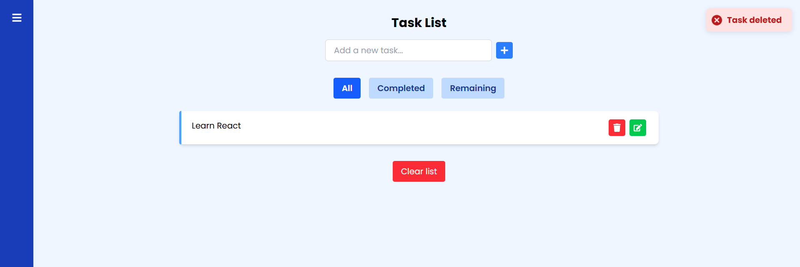
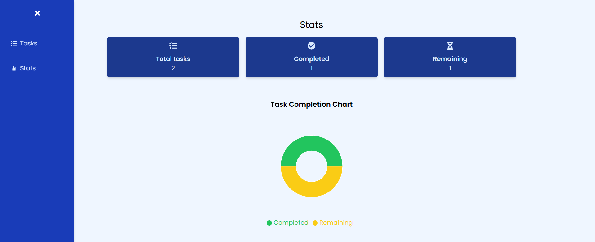

# TASKS MANAGEMENT APP

[](LICENSE) [](https://www.npmjs.com/package/todo-app) [](https://github.com/your-username/todo-app/actions)

A modern and feature-rich Todo application built with React and Vite. This app leverages Tailwind CSS for styling, Framer Motion for smooth animations, and Recharts for insightful task statistics visualization.

## Demo

Check out the live demo [here](https://your-demo-link.com).

## Screenshots





## Features

- Add, edit, and delete tasks with ease
- Mark tasks as completed or pending by clicking on tasks
- Filter tasks by all, completed, or remaining
- Animated UI interactions powered by Framer Motion
- Responsive design using Tailwind CSS
- Visualize task statistics with interactive charts using Recharts
- Notifications for task actions using react-hot-toast
- Persistent task storage using localStorage

## Installation

1. Clone the repository:
   ```bash
   git clone https://github.com/your-username/todo-app.git
   ```
2. Navigate to the project directory:
   ```bash
   cd todo-app
   ```
3. Install dependencies:
   ```bash
   npm install
   ```

## Usage

Start the development server:

```bash
npm run dev
```

Open your browser and go to `http://localhost:3000` to use the app.

## Environment Variables

This project does not require any environment variables or special configuration.

## Technologies Used

- React
- Vite
- Tailwind CSS for utility-first styling
- Framer Motion for animations
- Recharts for data visualization
- react-hot-toast for notifications
- React Router for routing
- JavaScript (ES6+)
- ESLint for code quality
- Jest for testing

## Testing

Run the test suite with:

```bash
npm test
```

## Contributing

Contributions are welcome! Please see [CONTRIBUTING.md](CONTRIBUTING.md) for details.

## License

This project is licensed under the MIT License. See the [LICENSE](LICENSE) file for details.
